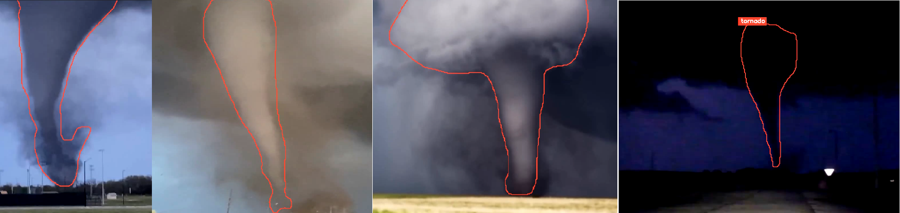

# Tornado Detection with YOLOv8 and Roboflow

This project demonstrates the use of the YOLOv8 object detection model to detect tornadoes in video footage. The model is capable of identifying and locating tornadoes, which can be useful for various applications such as weather monitoring, disaster management, and scientific research. The segmentation of the tornado dataset was done using Roboflow.

## Prerequisites

- Python 3.x
- OpenCV
- Ultralytics YOLOv8

You can install the required Python packages using pip:
```
pip install opencv-python ultralytics
```

## Usage

1. Clone this repository:

```
git clone https://github.com/evan-sctg/YOLOv8-Tornado-Tracker.git
```

2. Navigate to the project directory:

```
cd YOLOv8-Tornado-Tracker
```

3. Run the `tornado_detection.py` script:
```
python tornado_detection.py
```

This script will load the pre-trained YOLOv8 model, capture video from an RTSP stream (or a local video file), and perform real-time tornado detection. The detected tornadoes will be highlighted with bounding boxes and labels in the output video.

## Sample Output

Here's a sample output image showcasing the tornado detection capabilities of the model:



## Customization

You can customize the script to use different input sources (e.g., local video files, webcams) or modify the detection parameters as needed. Additionally, with train_tornado_detection.py you can train the YOLOv8 model on your own dataset using tools like Roboflow for dataset preparation and annotation.

```
python train_tornado_detection.py
```

## Acknowledgments

- [Ultralytics](https://github.com/ultralytics/ultralytics) for the YOLOv8 implementation
- [Roboflow](https://roboflow.com/) for the dataset annotation and preparation

## License

This project is licensed under the [MIT License](LICENSE).